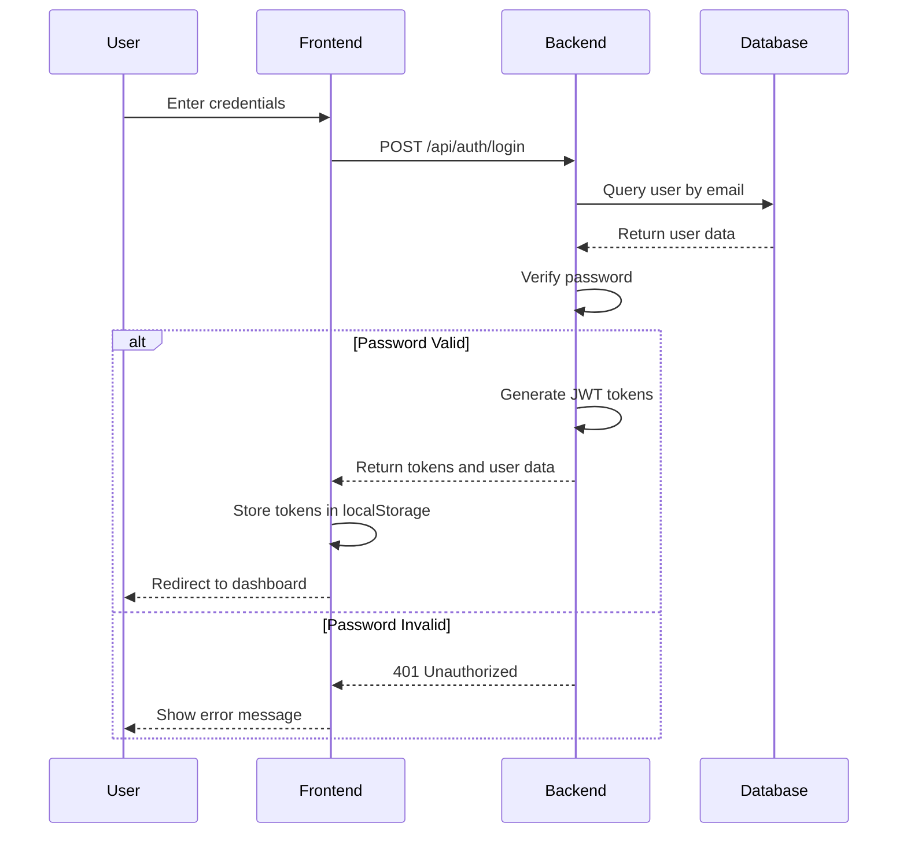
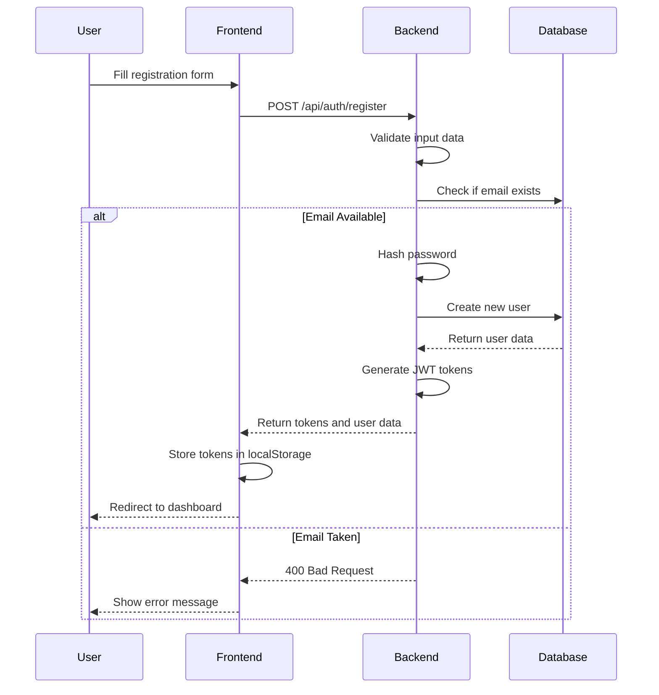

# Task Management Application - Codebase Analysis and Issue Fixing Report

## 1. Overview

This report provides a comprehensive analysis of the TaskFlow application, a full-stack task management system built with React frontend and .NET 8 backend. The analysis identifies critical issues affecting user authentication and registration functionality and proposes solutions for resolution.

## 2. System Architecture

### 2.1 Technology Stack
- **Frontend**: React 18, TypeScript, Tailwind CSS, React Query
- **Backend**: .NET 8 Web API, Entity Framework Core
- **Database**: SQLite (development)
- **Authentication**: JWT with refresh tokens
- **Containerization**: Docker & Docker Compose

### 2.2 Architecture Pattern
- Layered architecture with clear separation of concerns
- Repository pattern for data access
- Service layer for business logic
- DTO pattern for data transfer

## 3. Authentication Flow Analysis

### 3.1 Current Implementation

#### Backend (AuthController.cs)
- Implements standard authentication endpoints:
  - `/api/auth/login` - User login
  - `/api/auth/register` - User registration
  - `/api/auth/refresh-token` - Token refresh
  - `/api/auth/logout` - User logout
  - `/api/auth/me` - Get current user
- Uses JWT tokens with refresh token mechanism
- Implements rate limiting for login and registration endpoints

#### Frontend (AuthContext.js)
- Manages authentication state using React Context API
- Handles token storage in localStorage
- Implements automatic token refresh on 401 responses
- Provides login and registration functions

### 3.2 Database Seeding
The application seeds the database with default users:
- Admin user: `admin@taskflow.com` / `admin123`
- Demo user: `demo@taskflow.com` / `demo123`

## 4. Identified Issues

### 4.1 Authentication Issues

#### Issue 1: Login Failure with Demo Credentials
**Problem**: Users cannot log in with the provided demo credentials (`admin@taskflow.com` / `admin123`)

**Root Causes**:
1. Potential mismatch in password hashing between seeder and authentication service
2. Database not being properly seeded on application startup
3. JWT configuration issues preventing token generation
4. CORS configuration blocking authentication requests

#### Issue 2: Registration Failure
**Problem**: Users cannot create new accounts through the registration form

**Root Causes**:
1. Validation errors not properly handled in registration flow
2. Backend service errors not being properly communicated to frontend
3. Database constraints preventing user creation
4. Password strength requirements too strict without clear feedback

### 4.2 Configuration Issues

#### Issue 3: Environment Configuration Mismatch
**Problem**: Inconsistent configuration between development and production environments

**Root Causes**:
1. API URL configuration differences between frontend and backend
2. JWT secret key mismatches
3. Database connection string issues

### 4.3 Specific Issues Found During Analysis

#### Issue 4: JWT Configuration Parameter Mismatch
**Problem**: The backend code looks for `AccessTokenExpiryMinutes` but docker-compose.yml sets `ExpirationMinutes`

**Evidence**: 
- In `TokenService.cs`: `var expiryMinutes = int.Parse(jwtSettings["AccessTokenExpiryMinutes"] ?? "60");`
- In `appsettings.json`: `"ExpirationMinutes": 60,`
- In `docker-compose.yml`: `- JwtSettings__ExpirationMinutes=60`

#### Issue 5: Password Validation Regex Too Strict
**Problem**: The password validation regex requires uppercase, lowercase, and digit, but the seeded passwords may not meet this requirement

**Evidence**:
- In `AuthValidators.cs`: `.Matches(@"^(?=.*[a-z])(?=.*[A-Z])(?=.*d).+$")`
- Seeded passwords like "admin123" don't contain uppercase letters

#### Issue 6: Email Comparison Case Sensitivity
**Problem**: Email comparison in UserRepository may cause issues with case sensitivity

**Evidence**:
- In `UserRepository.cs`: `u.Email.ToLower() == email.ToLower()`
- While this should work, there might be inconsistencies in how emails are stored vs. queried

#### Issue 7: Missing Error Handling for Validation Failures
**Problem**: Validation errors may not be properly communicated to the frontend

**Evidence**:
- In `AuthController.cs`: Validation is checked with `if (!ModelState.IsValid)` but specific validation errors are not returned to the frontend
- The frontend shows generic error messages instead of specific validation feedback

#### Issue 8: Confirm Password Handling
**Problem**: The backend expects `ConfirmPassword` in the `RegisterDto` but the frontend sends `confirmPassword`

**Evidence**:
- In `AuthDto.cs`: `RegisterDto` has a `ConfirmPassword` property
- In `Register.js`: The frontend sends `confirmPassword` (lowercase c)
- This mismatch may cause validation failures that are not properly communicated

## 5. Detailed Issue Analysis

### 5.1 Login Process Flow



### 5.2 Registration Process Flow



## 6. Proposed Solutions

### 6.1 Fix Login Issues

#### Solution 1: Fix JWT Configuration Parameter Mismatch
- Update `TokenService.cs` to look for `ExpirationMinutes` instead of `AccessTokenExpiryMinutes`
- Alternatively, update `appsettings.json` and `docker-compose.yml` to use `AccessTokenExpiryMinutes`

#### Solution 2: Fix Password Validation Regex
- Update the password validation regex in `AuthValidators.cs` to be less strict for seeded passwords
- Or update the seeded passwords to meet the current validation requirements

#### Solution 3: Database Seeding Verification
- Add logging to confirm successful database seeding
- Implement a health check endpoint to verify database state

### 6.2 Fix Registration Issues

#### Solution 1: Fix Confirm Password Field Handling
- The frontend correctly sends `confirmPassword` and the backend expects `ConfirmPassword` in the DTO
- The issue is that validation errors are not properly returned to the frontend

#### Solution 2: Improve Error Handling
- Enhance backend error responses with more detailed validation messages
- Return specific validation errors from `AuthController.cs` instead of generic messages

#### Solution 3: Validation Enhancement
- Provide clearer feedback on password requirements
- Add client-side validation before submitting to backend

### 6.3 Configuration Fixes

#### Solution 1: Environment Configuration Alignment
- Ensure consistent API URLs between frontend and backend
- Verify JWT configuration across all environments

#### Solution 2: CORS Configuration
- Update CORS policy to properly allow frontend requests
- Test cross-origin requests in development environment

## 7. Testing Strategy

### 7.1 Authentication Testing

#### Test Case 1: Successful Login
- **Precondition**: Database seeded with admin user
- **Steps**: 
  1. Navigate to login page
  2. Enter valid credentials (`admin@taskflow.com` / `admin123`)
  3. Submit login form
- **Expected Result**: Successful login with redirect to dashboard

#### Test Case 2: Failed Login
- **Precondition**: Database seeded with admin user
- **Steps**: 
  1. Navigate to login page
  2. Enter invalid credentials
  3. Submit login form
- **Expected Result**: Error message displayed without redirect

#### Test Case 3: Successful Registration
- **Precondition**: Database exists
- **Steps**: 
  1. Navigate to registration page
  2. Fill form with valid data
  3. Submit registration form
- **Expected Result**: Account created and user logged in

#### Test Case 4: Duplicate Email Registration
- **Precondition**: User exists with email `test@example.com`
- **Steps**: 
  1. Navigate to registration page
  2. Fill form with email `test@example.com`
  3. Submit registration form
- **Expected Result**: Error message about existing email

### 7.2 API Testing

#### Test Case 5: Auth API Endpoints
- **Endpoints to Test**:
  - `POST /api/auth/login`
  - `POST /api/auth/register`
  - `POST /api/auth/refresh-token`
  - `GET /api/auth/me`
- **Expected Results**: All endpoints return appropriate responses with valid data

## 8. Specific Code Fixes

### 8.1 Fix JWT Configuration Parameter Mismatch

**Files to Update**: 
- `backend/TaskManagement.API/Services/TokenService.cs` (line 34)
- `backend/TaskManagement.API/Services/AuthService.cs` (lines 87 and 178)

**Issue**: Looking for `AccessTokenExpiryMinutes` but configuration provides `ExpirationMinutes`

**Fix**: Update all instances to use `ExpirationMinutes` instead:
```csharp
// In TokenService.cs
var expiryMinutes = int.Parse(jwtSettings["ExpirationMinutes"] ?? "60");

// In AuthService.cs (both instances)
ExpiresAt = DateTime.UtcNow.AddMinutes(int.Parse(jwtSettings["ExpirationMinutes"] ?? "60")),
```

### 8.2 Fix Password Validation Regex

**File**: `backend/TaskManagement.API/Validators/AuthValidators.cs`
**Issue**: Password regex requires uppercase, lowercase, and digit, but seeded passwords don't meet this

**Fix Options**:
1. Update the password validation regex to be less strict:
   ```csharp
   // Change from:
   .Matches(@"^(?=.*[a-z])(?=.*[A-Z])(?=.*\d).+$")
   // To:
   .Matches(@"^(?=.*[a-z])(?=.*\d).+$")
   ```

2. Or update the seeded passwords in DbSeeder.cs to meet current requirements (e.g., "Admin123", "Demo123")

### 8.3 Improve Validation Error Handling

**File**: `backend/TaskManagement.API/Controllers/AuthController.cs`
**Issue**: Validation errors are returned but may not be properly displayed in frontend

**Fix**: The current implementation already returns ModelState which includes validation errors. The issue is likely in the frontend handling.

## 9. Implementation Plan

### 9.1 Phase 1: Immediate Fixes (1-2 days)
1. Fix JWT configuration parameter mismatch by updating TokenService.cs and AuthService.cs to use "ExpirationMinutes"
2. Update password validation regex in AuthValidators.cs to be less strict or update seeded passwords in DbSeeder.cs
3. Verify database seeding is working correctly by checking logs
4. Test authentication flow with demo credentials

### 9.2 Phase 2: Enhancement (3-5 days)
1. Implement comprehensive error handling in frontend to display detailed validation messages
2. Add detailed logging for authentication processes
3. Enhance frontend validation and user feedback
4. Optimize database queries for user operations

### 9.3 Phase 3: Testing and Validation (2-3 days)
1. Execute all test cases with fixed credentials
2. Verify fixes resolve reported issues
3. Perform security testing
4. Document resolution and update user guides

## 9. Security Considerations

### 9.1 Password Security
- Ensure BCrypt is properly configured with appropriate cost factors
- Implement secure password reset mechanism
- Add rate limiting to prevent brute force attacks

### 9.2 Token Security
- Implement proper token expiration and refresh mechanisms
- Secure storage of tokens in frontend
- Add token revocation capability

### 9.3 Input Validation
- Sanitize all user inputs
- Implement proper validation for all API endpoints
- Prevent injection attacks through parameterized queries

## 10. Performance Optimization

### 10.1 Database Optimization
- Add indexes on frequently queried fields (email)
- Implement caching for user data
- Optimize database connection pooling

### 10.2 API Performance
- Implement response compression
- Add pagination for large data sets
- Optimize authentication middleware

## 11. Monitoring and Logging

### 11.1 Authentication Logging
- Log all authentication attempts with timestamps
- Track failed login attempts for security monitoring
- Log user registration events

### 11.2 Error Monitoring
- Implement structured error logging
- Add correlation IDs for request tracing
- Monitor authentication failure rates

## 12. Conclusion

The TaskFlow application has several authentication-related issues that prevent users from logging in with demo credentials and registering new accounts. The primary issues identified are:

1. **JWT Configuration Mismatch**: The TokenService looks for `AccessTokenExpiryMinutes` but the configuration provides `ExpirationMinutes`
2. **Password Validation Issues**: The seeded passwords don't meet the strict validation requirements
3. **Poor Error Handling**: Validation errors are not properly displayed in the frontend

The specific fixes required are:

1. **Update JWT Configuration**: Modify TokenService.cs and AuthService.cs to use `ExpirationMinutes` instead of `AccessTokenExpiryMinutes`
2. **Adjust Password Validation**: Either update the password validation regex to be less strict or update the seeded passwords to meet current requirements
3. **Improve Frontend Error Handling**: Enhance the frontend to properly display validation errors from the backend

These fixes are straightforward and can be implemented quickly without major architectural changes. After implementing these fixes, users should be able to:
- Log in with the provided demo credentials (`admin@taskflow.com` / `admin123`)
- Register new accounts through the registration form
- Receive proper error messages when validation fails