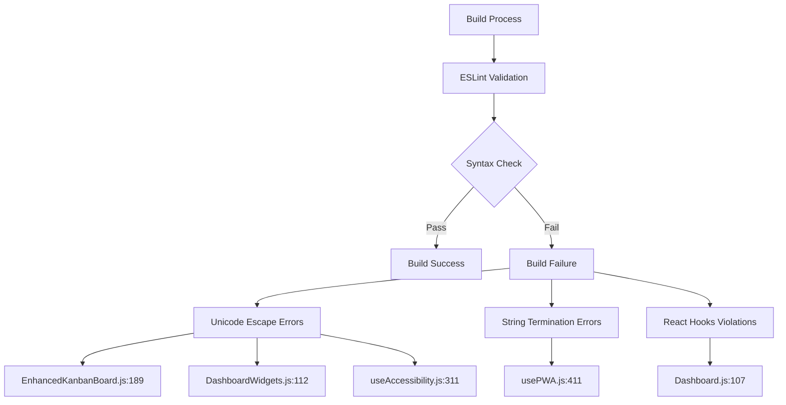
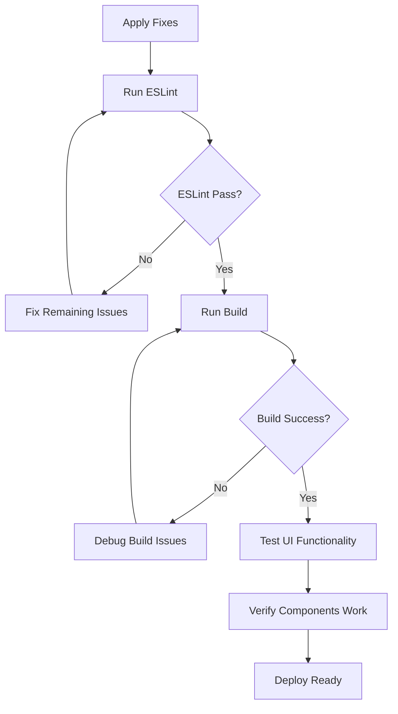

# Fix ESLint Errors - Design Document

## Overview

This design document outlines the resolution of critical ESLint errors preventing the frontend build from completing successfully. The errors include syntax violations, React hooks violations, and string formatting issues that must be fixed to restore the build process.

## Architecture

### Error Analysis

The build failure reveals five critical ESLint errors across four files:



### Error Classification

| Error Type | File | Line | Description | Severity |
|------------|------|------|-------------|----------|
| Unicode Escape | EnhancedKanbanBoard.js | 189:45 | Invalid escape sequence in string | Critical |
| Unicode Escape | DashboardWidgets.js | 112:57 | Invalid escape sequence in string | Critical |
| Unicode Escape | useAccessibility.js | 311:26 | Invalid escape sequence in string | Critical |
| String Termination | usePWA.js | 411:2 | Unterminated string constant | Critical |
| React Hooks | Dashboard.js | 107:30 | Conditional hook usage | Critical |

## Fix Strategy

### 1. String Escape Sequence Fixes

**Problem**: Template literals with invalid escape sequences
**Solution**: Fix string concatenation and escape sequences

#### EnhancedKanbanBoard.js (Line 189)
```javascript
// Current problematic code
className={`text-xs font-medium ${\n                        stat.changeType === 'increase' \n                          ? 'text-green-600' \n                          : 'text-red-600'\n                      }`}

// Fixed code
className={`text-xs font-medium ${
  stat.changeType === 'increase' 
    ? 'text-green-600' 
    : 'text-red-600'
}`}
```

#### DashboardWidgets.js (Line 112)
```javascript
// Current problematic code
className={`text-xs font-medium ${\n                        stat.changeType === 'increase' \n                          ? 'text-green-600' \n                          : 'text-red-600'\n                      }`}\n                    >

// Fixed code
className={`text-xs font-medium ${
  stat.changeType === 'increase' 
    ? 'text-green-600' 
    : 'text-red-600'
}`}
```

### 2. String Termination Fix

**Problem**: Unterminated string in usePWA.js
**Solution**: Properly close string literals

#### useAccessibility.js (Line 311)
```javascript
// Current problematic code
};"

// Fixed code  
};
```

#### usePWA.js (Line 411)
```javascript
// Current problematic code (unterminated string)
};"

// Fixed code
};
```

### 3. React Hooks Rule Fix

**Problem**: Conditional hook usage violating React hooks rules
**Solution**: Move hook outside conditional logic

#### Dashboard.js (Line 107)
```javascript
// Current problematic code
const performanceMetrics = React.useMemo(() => {
  if (!tasks || tasks.length === 0) return {};
  // ... rest of the logic
}, [tasks, users]);

// Fixed code - move condition inside useMemo
const performanceMetrics = React.useMemo(() => {
  if (!tasks || tasks.length === 0) {
    return {
      completionRate: 0,
      productivityScore: 0,
      teamMetrics: {},
      weeklyTrends: [],
      insights: []
    };
  }
  
  return {
    completionRate: PerformanceAnalytics.calculateTaskCompletionRate(tasks),
    productivityScore: PerformanceAnalytics.calculateProductivityScore(tasks),
    teamMetrics: PerformanceAnalytics.getTeamProductivityMetrics(tasks, users || []),
    weeklyTrends: PerformanceAnalytics.getWeeklyTrends(tasks),
    insights: PerformanceAnalytics.generateInsights(tasks)
  };
}, [tasks, users]);
```

## Implementation Plan

### Phase 1: String and Syntax Fixes
1. **EnhancedKanbanBoard.js**: Fix template literal escape sequences
2. **DashboardWidgets.js**: Fix template literal escape sequences  
3. **useAccessibility.js**: Remove invalid string terminator
4. **usePWA.js**: Fix unterminated string constant

### Phase 2: React Hooks Compliance
1. **Dashboard.js**: Restructure useMemo to avoid conditional hook usage
2. Ensure all hooks follow React rules of hooks

### Phase 3: Validation
1. Run ESLint manually to verify fixes
2. Test build process to ensure successful compilation
3. Verify functionality is not affected by changes

## ESLint Configuration Enhancement

### Current Configuration
```json
{
  "eslintConfig": {
    "extends": [
      "react-app",
      "react-app/jest"
    ]
  }
}
```

### Recommended Enhancements
```json
{
  "eslintConfig": {
    "extends": [
      "react-app",
      "react-app/jest"
    ],
    "rules": {
      "react-hooks/rules-of-hooks": "error",
      "react-hooks/exhaustive-deps": "warn",
      "no-unused-vars": "warn",
      "prefer-const": "error"
    }
  }
}
```

## Testing Strategy

### Pre-Fix Validation
```bash
# Verify current build failure
cd frontend
npm run build
# Expected: Build fails with ESLint errors
```

### Post-Fix Validation
```bash
# Test individual ESLint check
npx eslint src/ --ext .js,.jsx

# Test build process
npm run build
# Expected: Build succeeds without ESLint errors
```

### Functional Testing


## Risk Mitigation

### Backup Strategy
- Create git branch before applying fixes
- Test each file change incrementally
- Maintain functionality while fixing syntax

### Rollback Plan
- Git revert available for each file
- Incremental commits for each fix
- Preserve original logic and functionality

## Success Criteria

1. **Build Success**: Frontend build completes without ESLint errors
2. **Functionality Preserved**: All UI components work as expected
3. **Performance Maintained**: No performance degradation
4. **Code Quality**: Improved ESLint compliance

## Files to Modify

1. `frontend/src/components/kanban/EnhancedKanbanBoard.js` (Line 189)
2. `frontend/src/components/widgets/DashboardWidgets.js` (Line 112)  
3. `frontend/src/hooks/useAccessibility.js` (Line 311)
4. `frontend/src/hooks/usePWA.js` (Line 411)
5. `frontend/src/pages/Dashboard.js` (Line 107)