# TaskFlow Application Enhancement Design

## 1. Overview

This design document outlines comprehensive improvements to the TaskFlow task management application, focusing on both user interface modernization and backend architecture enhancements. The improvements aim to deliver a more intuitive user experience, better performance, enhanced security, and scalable architecture.

### Current State Assessment
- **Frontend**: React 18 with basic Tailwind CSS styling, functional but lacks modern UX patterns
- **Backend**: .NET 8 Web API with basic CRUD operations, missing advanced features like authentication and real-time capabilities
- **Architecture**: Solid foundation with repository pattern and service layers, but needs enhancement for enterprise-grade features

### Enhancement Objectives
- Modernize UI/UX with advanced design patterns and micro-interactions
- Implement robust authentication and authorization
- Add real-time collaboration features
- Enhance performance and scalability
- Improve data visualization and analytics
- Strengthen security posture

## 2. Frontend Architecture Enhancements

### 2.1 Modern UI/UX Improvements

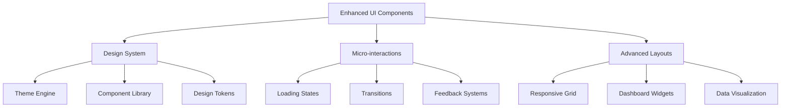

#### Design System Implementation
- **Enhanced Theme Engine**: Extend current dark mode with multiple themes, custom color schemes, and user preferences
- **Advanced Component Library**: Create reusable, accessible components with consistent styling and behavior
- **Design Token System**: Implement centralized design tokens for colors, typography, spacing, and shadows

#### Modern Layout Enhancements
- **Dashboard Widgets**: Draggable, resizable dashboard widgets for personalized workspace
- **Advanced Grid System**: Implement CSS Grid and Flexbox for complex layouts
- **Progressive Web App (PWA)**: Add service worker for offline functionality and app-like experience

### 2.2 Enhanced Component Architecture

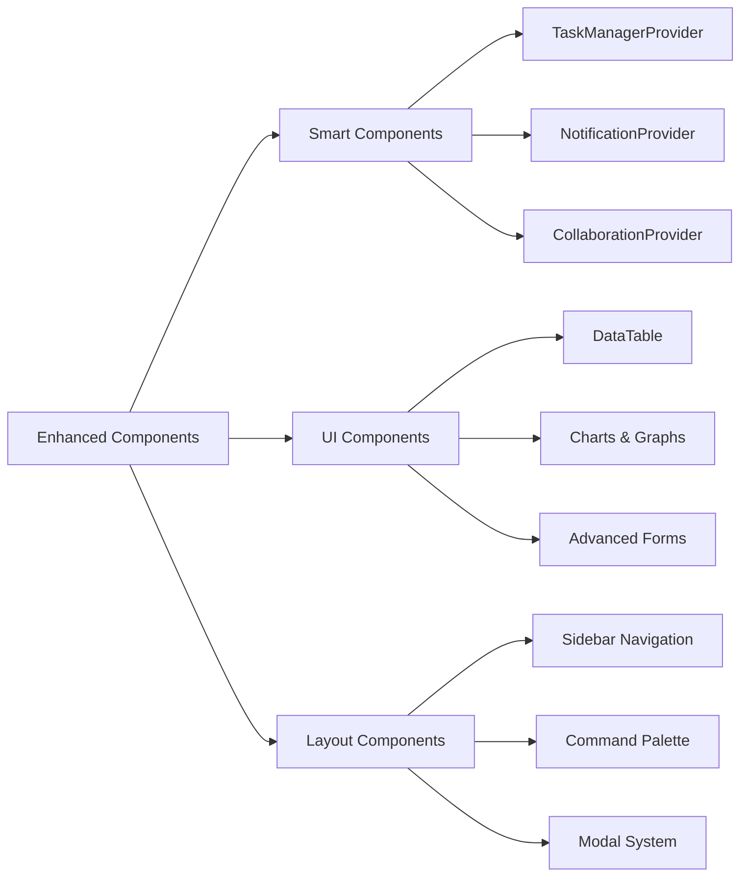

#### New Component Categories

**Data Visualization Components**
- Interactive charts (Gantt charts, burndown charts, progress meters)
- Advanced filtering and search interfaces
- Data export capabilities
- Real-time data synchronization

**Advanced Interaction Components**
- Command palette for quick actions (Ctrl+K pattern)
- Keyboard shortcuts system
- Drag-and-drop file upload areas
- Advanced form validation with real-time feedback

**Collaboration Components**
- Real-time user presence indicators
- Live cursors and selections
- Comment and mention system
- Activity feed with live updates

### 2.3 State Management Enhancement

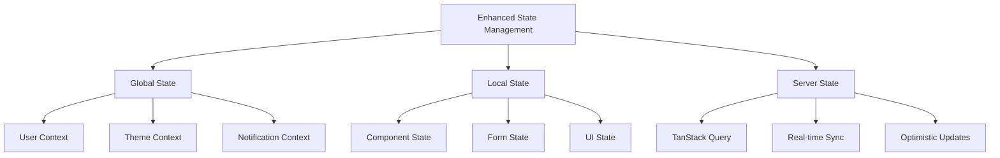

#### Implementation Strategy
- **Upgrade React Query**: Migrate to TanStack Query v4 for improved caching and synchronization
- **Enhanced Context Providers**: Implement user preferences, collaboration state, and notification management
- **Optimistic Updates**: Implement optimistic UI updates with rollback capabilities

## 3. Backend Architecture Enhancements

### 3.1 Authentication & Authorization System

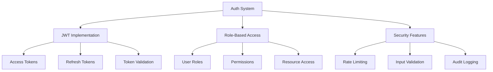

#### Authentication Implementation
- **JWT Token System**: Implement secure JWT authentication with refresh token rotation
- **OAuth Integration**: Support for Google, Microsoft, and GitHub OAuth providers
- **Role-Based Access Control**: Implement Admin, Manager, Member, and Viewer roles with granular permissions
- **Multi-Factor Authentication**: Add optional 2FA using TOTP (Time-based One-Time Password)

#### Authorization Enhancements
- **Resource-Level Permissions**: Fine-grained control over task, project, and team access
- **Team-Based Access**: Hierarchical team structure with inherited permissions
- **API Key Management**: Support for API keys for third-party integrations

### 3.2 Real-Time Communication System

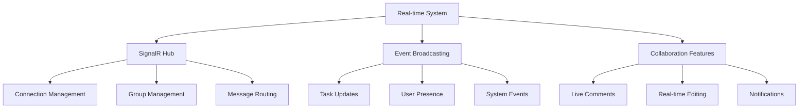

#### Real-Time Features Implementation
- **SignalR Integration**: Implement WebSocket connections for real-time updates
- **Live Collaboration**: Real-time task editing, commenting, and status updates
- **User Presence System**: Show online users, active tasks, and current activities
- **Push Notifications**: Browser and email notifications for important events

### 3.3 Enhanced Data Layer

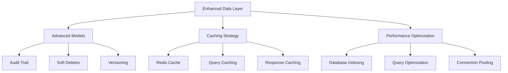

#### Data Model Enhancements

**Audit and Versioning System**
- Complete audit trail for all entity changes
- Soft delete implementation with recovery capabilities
- Task history and version tracking
- Change attribution and timestamps

**Performance Optimizations**
- Redis caching layer for frequently accessed data
- Database query optimization with proper indexing
- Pagination and lazy loading for large datasets
- Background job processing for heavy operations

### 3.4 Advanced API Features

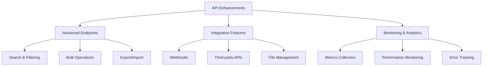

#### New API Capabilities
- **Advanced Search**: Full-text search, filters, and complex queries
- **Bulk Operations**: Batch updates, imports, and exports
- **File Management**: Task attachments, image uploads, and document storage
- **Webhook System**: Configurable webhooks for external integrations
- **Analytics API**: Task metrics, user productivity, and team performance data

## 4. New Feature Implementations

### 4.1 Advanced Task Management

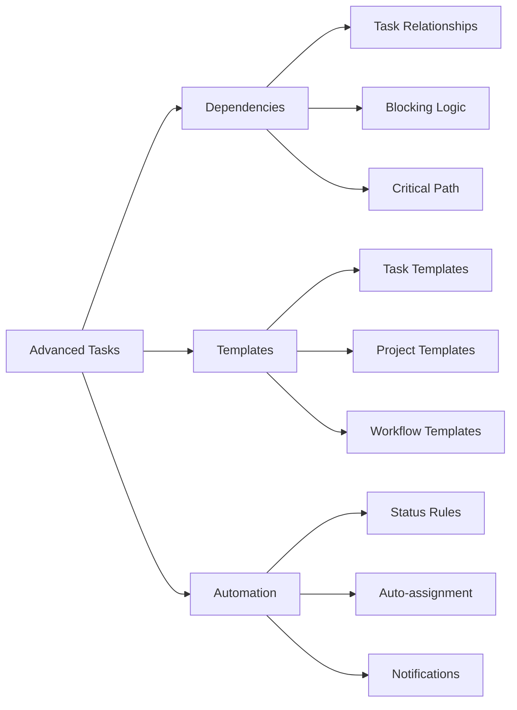

#### Task Enhancement Features
- **Task Dependencies**: Implement task relationships with blocking/waiting logic
- **Task Templates**: Reusable task and project templates with predefined workflows
- **Time Tracking**: Built-in time logging with productivity analytics
- **Task Automation**: Rule-based task assignment and status transitions
- **Subtasks & Hierarchies**: Nested task structure with progress rollup

### 4.2 Project Management Features

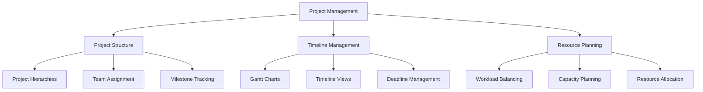

#### Project Management Implementation
- **Project Hierarchies**: Organize tasks within projects and portfolios
- **Gantt Chart Visualization**: Interactive timeline view with dependencies
- **Resource Management**: Team workload balancing and capacity planning
- **Milestone Tracking**: Project phases with deliverable management
- **Budget Tracking**: Time and cost estimation with variance reporting

### 4.3 Analytics and Reporting

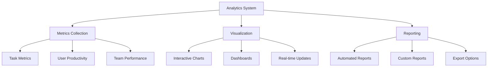

#### Analytics Implementation
- **Task Analytics**: Completion rates, cycle time, and bottleneck identification
- **User Productivity**: Individual performance metrics and workload analysis
- **Team Performance**: Collaboration metrics and efficiency indicators
- **Custom Dashboards**: Configurable widgets and KPI tracking
- **Automated Reporting**: Scheduled reports with email delivery

## 5. User Experience Enhancements

### 5.1 Modern UI Patterns

| Component | Enhancement | Implementation |
|-----------|-------------|----------------|
| Navigation | Collapsible sidebar with quick access | CSS Grid + JavaScript animations |
| Search | Global search with autocomplete | Elasticsearch integration |
| Forms | Multi-step wizards with validation | React Hook Form + Zod validation |
| Tables | Virtual scrolling for large datasets | TanStack Table with virtualization |
| Modals | Stacked modals with focus management | React Portal + Focus trap |
| Notifications | Toast system with action buttons | React Hot Toast extensions |

### 5.2 Accessibility Improvements

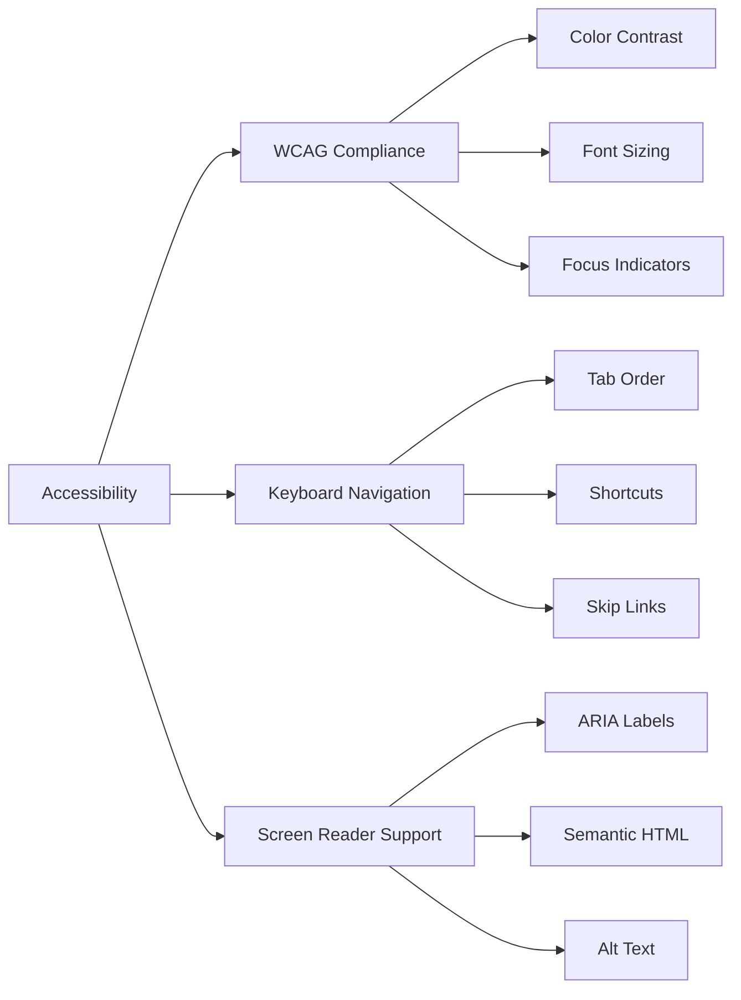

#### Accessibility Implementation
- **WCAG 2.1 AA Compliance**: Full accessibility audit and implementation
- **Keyboard Navigation**: Complete keyboard-only navigation support
- **Screen Reader Optimization**: Proper ARIA labels and semantic HTML
- **High Contrast Mode**: Alternative themes for visual accessibility
- **Reduced Motion**: Respect user's motion preferences

### 5.3 Mobile Experience Enhancement

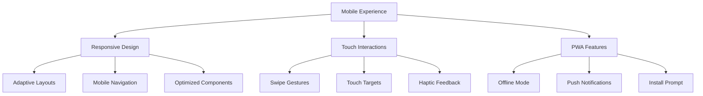

#### Mobile Enhancements
- **Touch-First Design**: Optimized touch targets and gesture support
- **Progressive Web App**: Full PWA capabilities with offline functionality
- **Mobile-Specific Features**: Swipe actions, pull-to-refresh, and bottom sheets
- **Performance Optimization**: Code splitting and lazy loading for mobile

## 6. Performance & Security Enhancements

### 6.1 Performance Optimization Strategy

| Area | Current State | Enhancement | Expected Improvement |
|------|---------------|-------------|---------------------|
| Frontend Bundle | 2.5MB initial | Code splitting + lazy loading | 60% reduction |
| API Response Time | 200ms avg | Caching + optimization | 70% improvement |
| Database Queries | N+1 issues | Query optimization | 80% faster |
| Real-time Updates | Polling | WebSocket connections | 90% less bandwidth |

### 6.2 Security Implementation

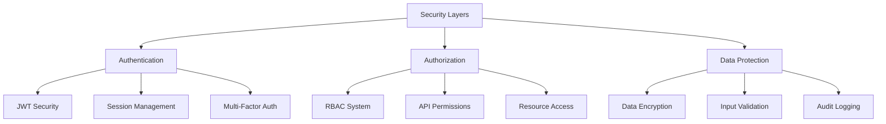

#### Security Enhancement Features
- **Advanced Input Validation**: Comprehensive sanitization and validation
- **Rate Limiting**: API throttling and abuse prevention
- **Security Headers**: HTTPS enforcement, CSP, and security headers
- **Data Encryption**: Encryption at rest and in transit
- **Audit Trail**: Complete security event logging and monitoring

## 7. Integration & Third-Party Services

### 7.1 External Integrations

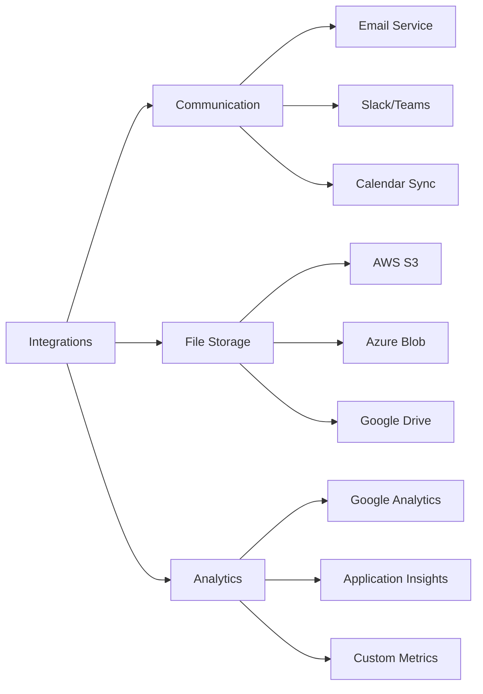

#### Integration Implementation
- **Email Service**: SMTP integration for notifications and reports
- **Calendar Sync**: Two-way sync with Google Calendar and Outlook
- **File Storage**: Cloud storage integration for attachments
- **Communication Tools**: Slack and Microsoft Teams integration
- **Business Intelligence**: Export data to BI tools and analytics platforms

### 7.2 API Extensions

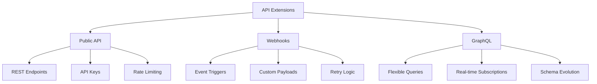

#### API Enhancement Features
- **Public API**: Well-documented REST API for third-party integrations
- **GraphQL Endpoint**: Flexible data fetching for complex client needs
- **Webhook System**: Event-driven integrations with external systems
- **API Versioning**: Backward-compatible API evolution strategy

## 8. Testing Strategy

### 8.1 Frontend Testing Enhancement

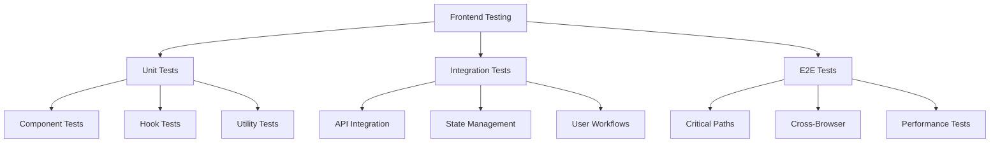

#### Testing Implementation
- **Jest + React Testing Library**: Comprehensive component and hook testing
- **Cypress**: End-to-end testing for critical user journeys
- **Storybook**: Component documentation and visual testing
- **Performance Testing**: Lighthouse CI and Core Web Vitals monitoring

### 8.2 Backend Testing Strategy

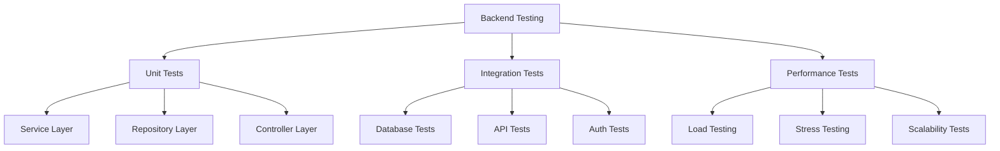

#### Backend Testing Enhancement
- **xUnit + Moq**: Comprehensive unit testing with mocking
- **Integration Testing**: Database and API integration testing
- **Load Testing**: Performance testing with realistic data volumes
- **Security Testing**: Penetration testing and vulnerability assessment